# Job-Pilot: AI Driven Job Automation

## Demo

[](./static/assets/JobPilot_Video/JobPilot_Demo.mp4)


## ScreenShots:

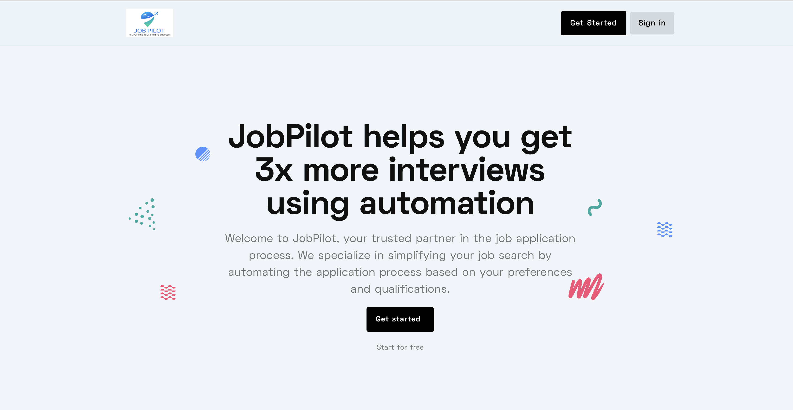
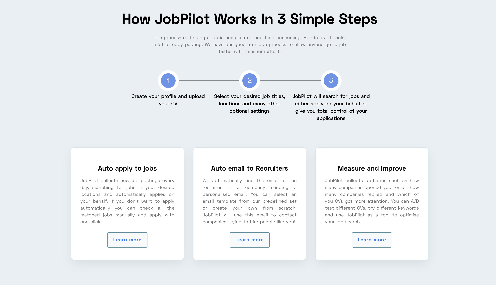
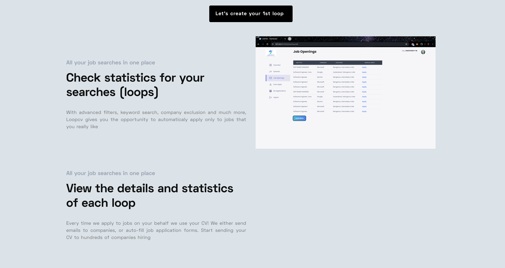
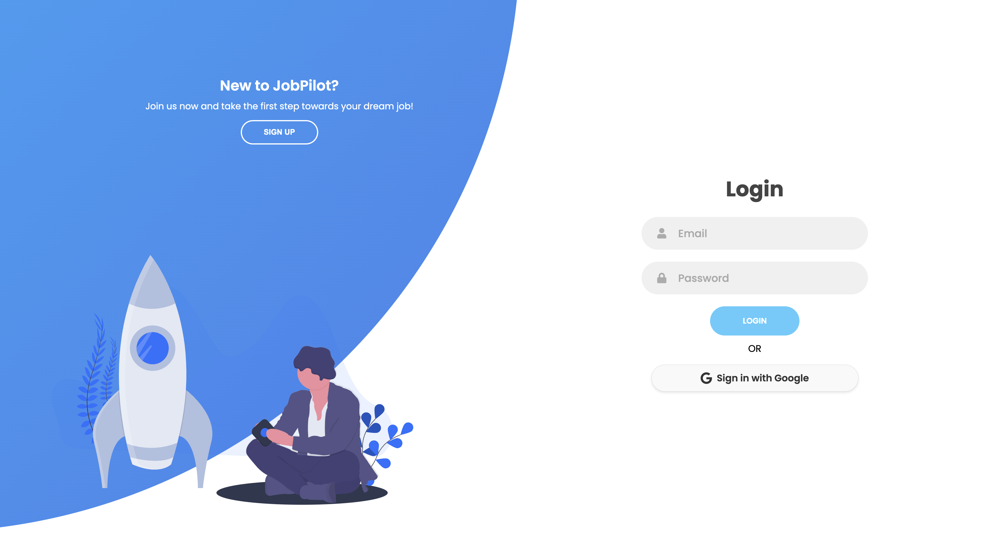
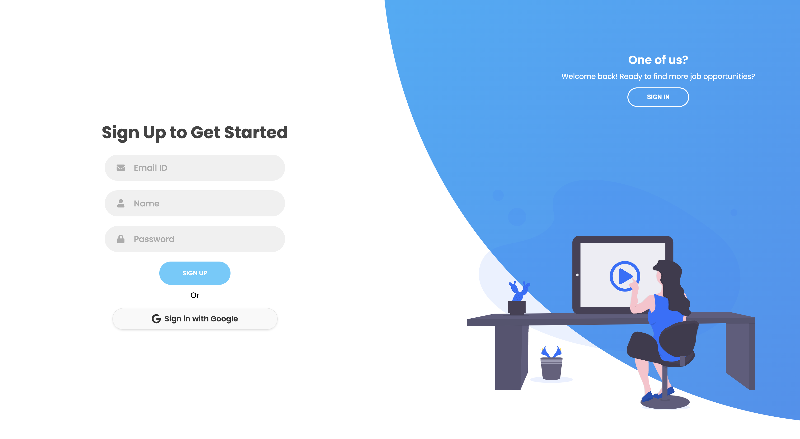
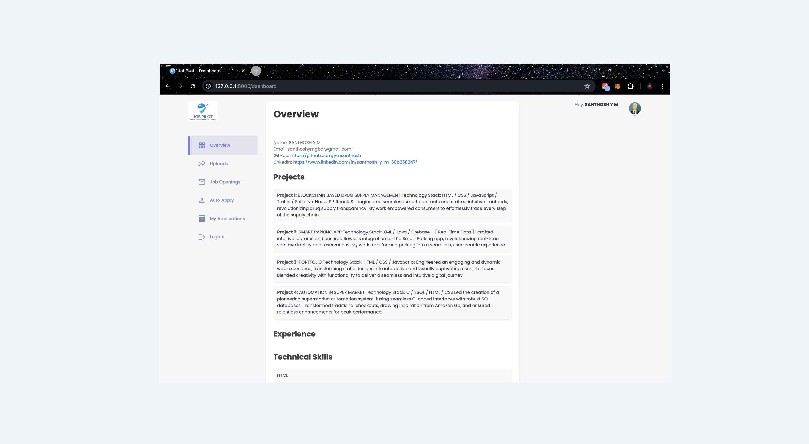
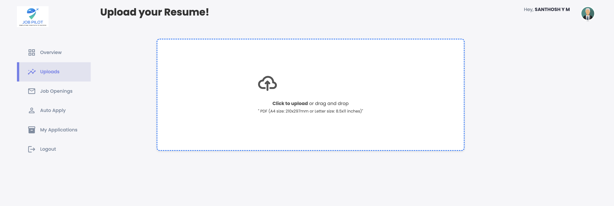
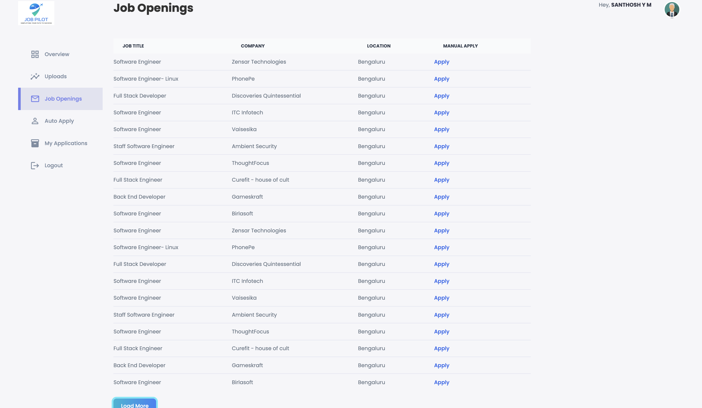
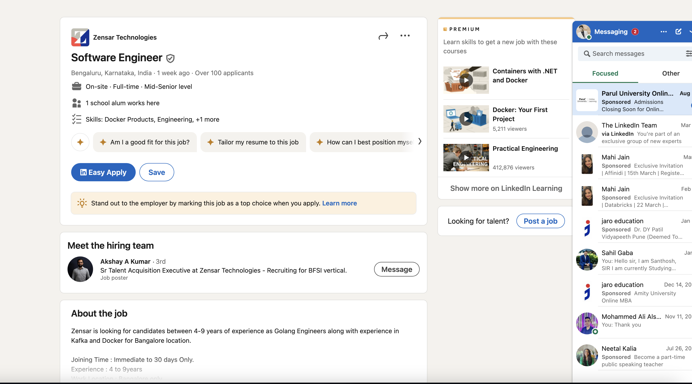
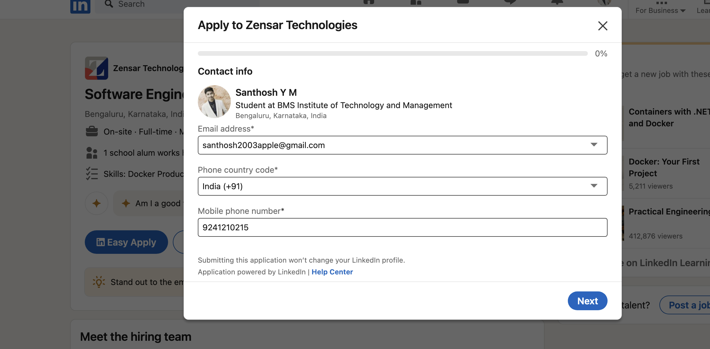
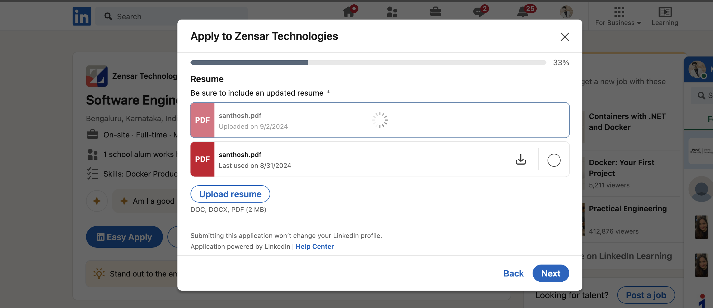
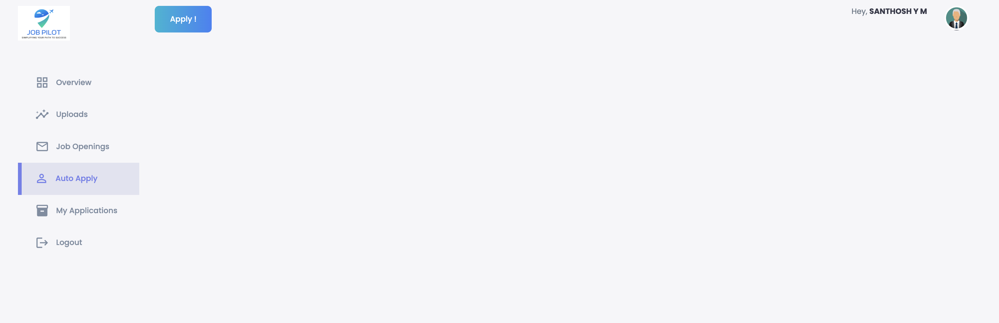
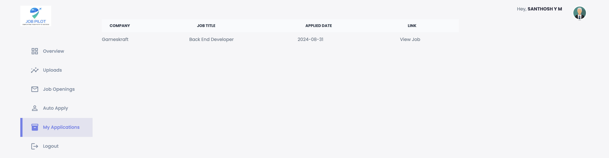

## 🔧 Setting up

### Step 1

Clone the repository:

**Linux and macOS:**

```bash
git clone https://github.com/ymsanthosh/Job-Pilot-AI-Driven-Job-Automation.git
```

**Windows:**

```bash
git clone hhttps://github.com/ymsanthosh/Job-Pilot-AI-Driven-Job-Automation.git

```

### Step 2

Install dependencies:

```bash
cd Job-Pilot
pip install -r requirements.txt
```
### Step 3

```bash
Run the Flask application:

python app.py

```

> `NOTE: Google Auth API Key: Replace the placeholder in the config.py file with your `Google Auth API key.``
> `NOTE: Gemini Model API Key: Add your Gemini Model API key in the `config.py` file where indicated.`
>` NOTE:LinkedIn Email and Password: Update the config.py file with your `LinkedIn email and password.``
> `NOTE:MongoDB Connection: Replace the placeholder MongoDB connection string in the config.py file with your actual MongoDB connection URI.`


This `README.md` file includes:

- A demo video section with a clickable thumbnail that links to the video file.
- Detailed setup instructions for running the project locally with Flask.
- A section for screenshots with specified paths.
- A thank you note at the end.

Feel free to customize any section as needed!

